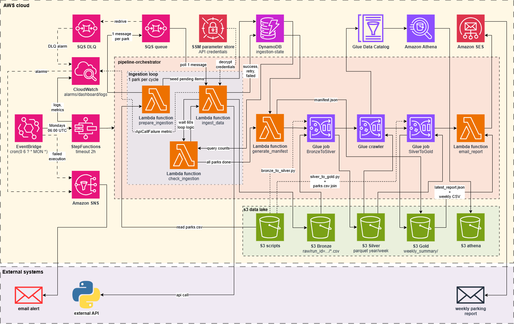
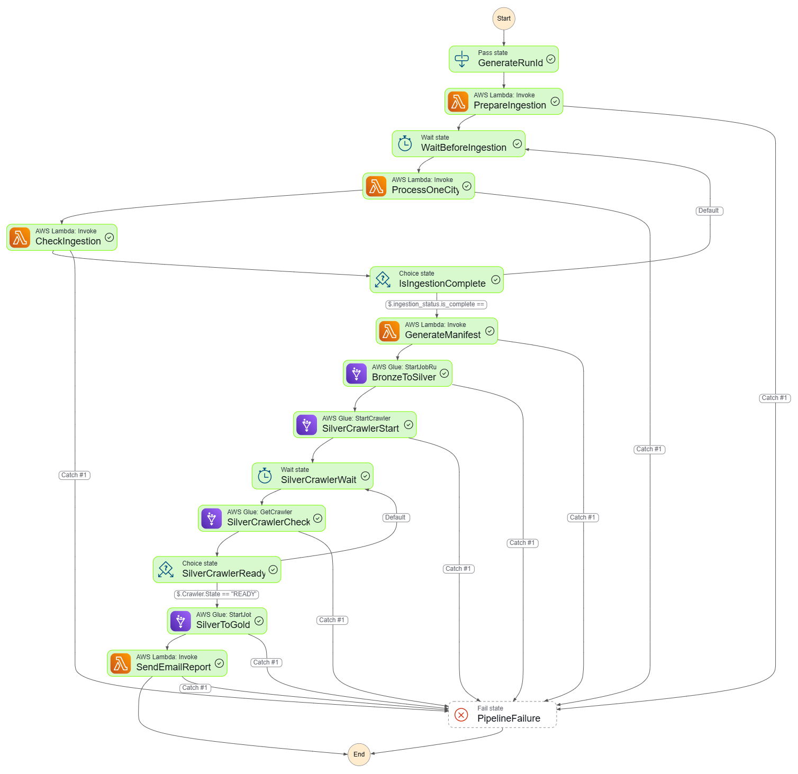
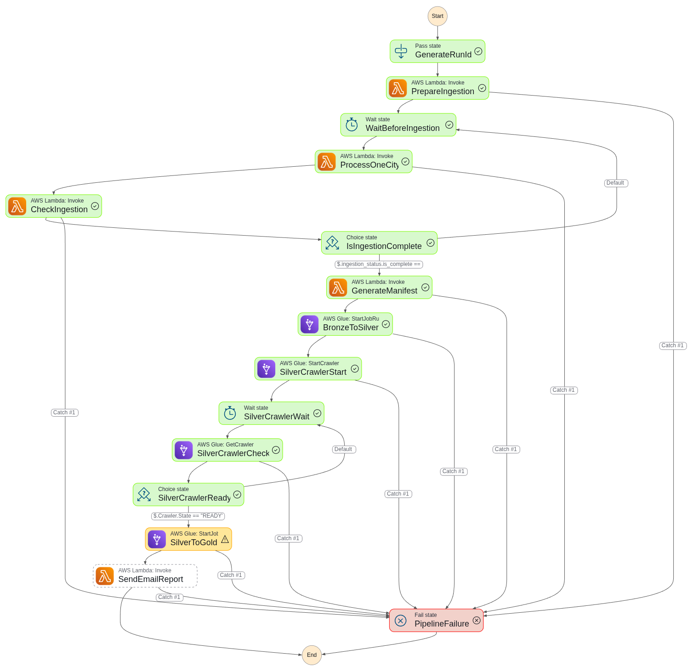
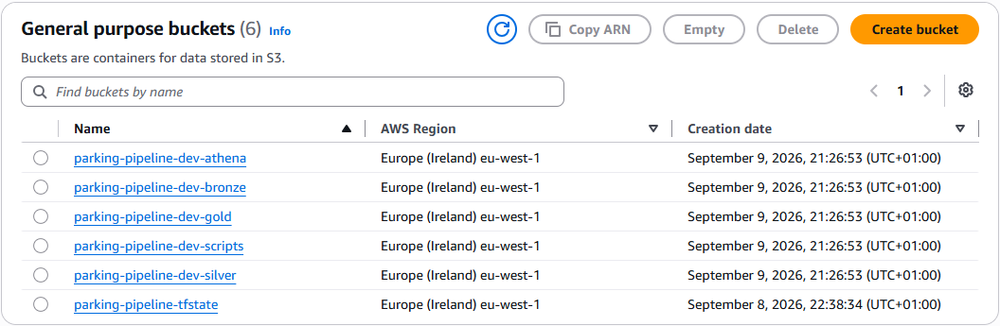
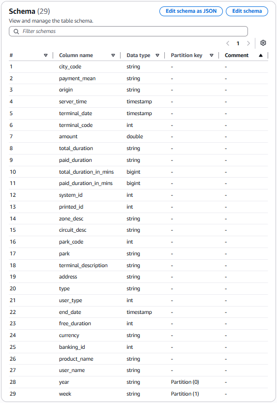
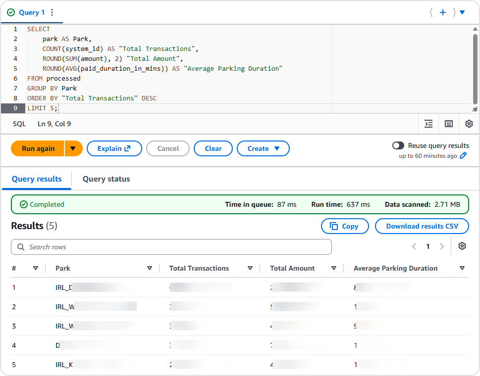
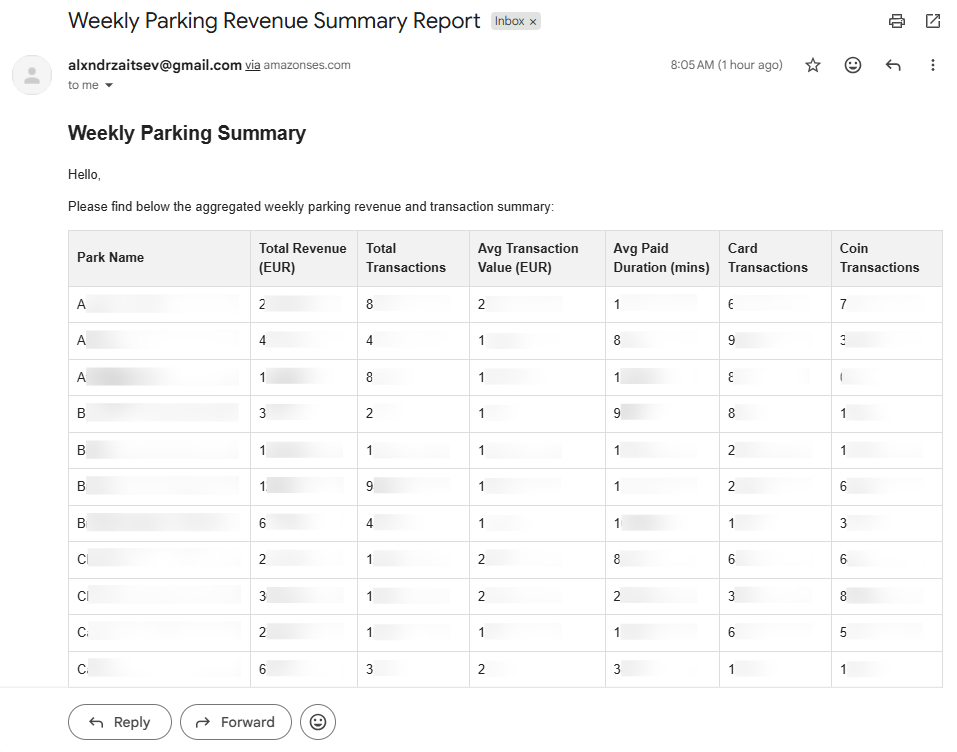
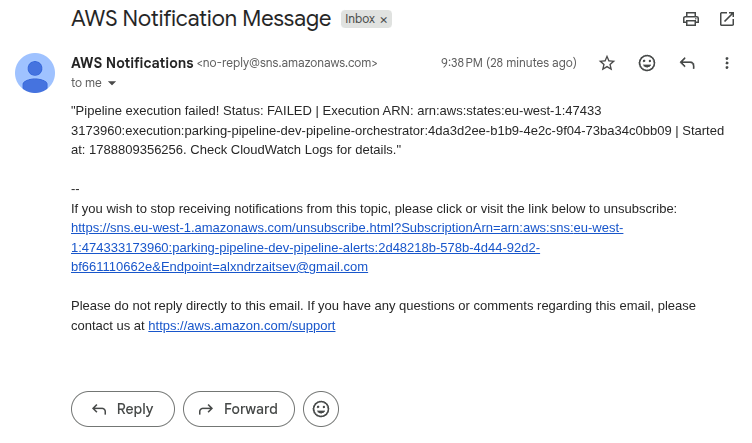

[](https://github.com/alxndrztsv/aws-parking-data-pipeline-work/actions/workflows/ci.yml) [](https://github.com/alxndrztsv/aws-parking-data-pipeline-work/actions/workflows/cd.yml)

# AWS Parking Data Pipeline

An end-to-end data pipeline for **real** transaction data from on-street and 
off-street parking terminals across Ireland, built on a medallion architecture 
(Bronze → Silver → Gold) with fully automated AWS infrastructure.

This project pulls live data from a parking operator's
HTTP API. The API serves **one park per call** and rate-limits to
**one request per 60 seconds**, so ingestion is modelled as a queue-driven loop
that paces itself and tracks per-park progress in DynamoDB.

## Architecture

<p align="center">
  <a href="https://raw.githubusercontent.com/alxndrztsv/aws-parking-data-pipeline-work/main/docs/architecture-diagram.png" target="_blank">
    
  </a>
  <br>
  <em>End-to-end data pipeline architecture.</em>
</p>

Pipeline stages:

1. **Prepare** — a Lambda reads the park reference list, writes a `pending` row per
   park into DynamoDB, and enqueues one SQS message per park.
2. **Ingest** — Step Functions loops: wait 60 s (API rate limit) → invoke the ingest
   Lambda → it takes one SQS message, calls the API, and on success writes the raw
   CSV to the Bronze bucket (`raw/run_id=<run>/<city_code>.csv`) and marks the park
   `success`. Failures retry up to `max_receive_count`, then are marked `failed`.
3. **Check** — a Lambda queries DynamoDB by `run_id`; the loop repeats until no park
   is `pending`.
4. **Manifest** — a Lambda writes a per-run JSON manifest (success/failed/pending) to Gold.
5. **Bronze → Silver** — a Glue (PySpark) job validates and standardises the raw CSVs.
6. **Crawl** — a Glue crawler registers the Silver data in the Glue Data Catalog.
7. **Silver → Gold** — a second Glue job joins the park reference and aggregates the
   previous week into a CSV, then writes a `latest_report.json` pointer.
8. **Report** — a Lambda reads the pointer, loads the weekly CSV, and emails an HTML
   report via SES.
9. **Alerting** — any Step Functions failure is published to an SNS topic and emailed.

## Tech stack

| Area | Technology |
| --- | --- |
| Infrastructure as Code | Terraform (S3 backend with native S3 state locking) |
| Storage | S3 (Bronze / Silver / Gold / scripts / athena buckets) |
| Ingestion state | DynamoDB (on-demand) + SQS queue with DLQ |
| Secrets | SSM Parameter Store (SecureString) |
| ETL | AWS Glue 4.0 (PySpark, 2 × G.1X) |
| Catalog | Glue Data Catalog + Crawler |
| Orchestration | Step Functions + EventBridge schedule |
| Query | Amazon Athena (dedicated workgroup) |
| Reporting | Lambda (Python 3.11) + SES |
| Alerting | SNS + EventBridge failure rules + CloudWatch alarms/dashboard |
| CI/CD | GitHub Actions (OIDC, no static keys) |

## Repository structure

```
.
├── glue_scripts/        # PySpark ETL jobs (uploaded to S3 by Terraform)
├── lambda_functions/    # prepare/ingest/check/manifest/email Lambda sources
├── reference_data/      # parks.csv — the park list (kept local, see below)
├── terraform-bootstrap/ # One-time setup: the tfstate S3 bucket
├── terraform/           # Main infrastructure
├── docs/                # Screenshots used in this README
└── .github/workflows/   # CI (lint + validate) and CD (plan/apply)
```

## Prerequisites

- An AWS account with permission to create IAM roles, S3, DynamoDB, SQS, Glue,
  Lambda, SES, SNS, SSM, Step Functions, EventBridge and CloudWatch resources.
- [Terraform](https://www.terraform.io/) **≥ 1.10** (the backend uses S3 native
  state locking via `use_lockfile`).
- Python 3.11+ locally for linting.
- A **verified identity in SES** (the sender address). In the SES sandbox both the
  sender and recipient must be verified.
- Valid **API credentials** for the parking data source.

## Getting started

### 1. Bootstrap the Terraform backend

`terraform-bootstrap/` creates the S3 bucket that stores the main Terraform state.
It runs with **local** state and is applied once:

```bash
cd terraform-bootstrap
terraform init
terraform apply \
  -var="github_repo=<YOUR_GITHUB_USER>/<YOUR_REPO>" \
  -var="github_owner_id=<OWNER_ID>" \
  -var="github_repo_id=<REPO_ID>"
```

> If `apply` fails with `BucketAlreadyExists`, change the name in **both**
> `terraform-bootstrap/main.tf` and `terraform/backend.hcl`, then re-apply.
> Keep the resulting `terraform-bootstrap/terraform.tfstate` — it is gitignored and
> needed for any future change to the state bucket.

### 2. Configure Terraform variables

Copy the example and fill in real values:

```bash
cp terraform/terraform.tfvars.example terraform/terraform.tfvars
```

```hcl
aws_region                 = "eu-west-1"
environment                = "dev"
project_name               = "parking-pipeline"
sender_email               = "you@example.com"      # verified in SES
recipient_email            = "you@example.com"      # receives the weekly report
failure_notification_email = "you@example.com"      # receives pipeline alerts
api_login                  = "<API login>"
api_password               = "<API password>"
api_url                    = "<API url>"
max_receive_count          = 4
```

`terraform.tfvars` is **gitignored** — never commit it. The API credentials are
written to **SSM Parameter Store as `SecureString`** (encrypted at rest); the ingest
Lambda holds only the SSM *paths* in its environment and decrypts them at runtime.

> **Note on Terraform state:** SSM parameter *values* are stored in plain text inside
> the Terraform state file (a known Terraform behaviour). The state lives in the
> private, encrypted, TLS-only bootstrap bucket, so treat access to that bucket as
> sensitive.

### 3. Keep the park list private

`reference_data/parks.csv` maps each park to its API `city_code`. Terraform uploads it
to the `scripts` bucket, which is **already private** (public-access block, TLS-only
policy, AES-256 encryption). To avoid exposing it on GitHub, the file is **gitignored**
and kept only on your machine / injected as a secret in CI — see
[Hiding parks.csv](#hiding-parkscsv).

### 4. Deploy

```bash
cd terraform
terraform init -backend-config=backend.hcl
terraform plan
terraform apply
```

The apply uploads the Glue scripts and `parks.csv` to the `scripts` bucket, creates the
Lambda deployment packages, and wires up the whole pipeline.

### 5. Verify

- Confirm the **SNS subscription** email so failure alerts are delivered.
- **SES sandbox:** the recipient must be verified, otherwise delivery silently fails.
- Trigger the pipeline manually: **Step Functions → `parking-pipeline-dev-pipeline-orchestrator`
  → Start execution** with empty input (`{}`); the `run_id` is taken from the execution
  name. Or wait for the weekly schedule (**Mondays 06:00 UTC**).
- Watch progress in **CloudWatch Logs** (`/aws/lambda/parking-pipeline-dev-*`) and the
  **CloudWatch dashboard** `parking-pipeline-dev-pipeline`.

## Hiding parks.csv

The CSV is not a credential, but you may not want it in a public repo. The `scripts`
bucket it lands in is already private, so the only thing to control is GitHub:

- **Local deploys:** `reference_data/parks.csv` is gitignored. It stays on your disk,
  Terraform uploads it to the private bucket, and it never reaches GitHub.
- **GitHub Actions deploys:** store the CSV contents in a repository **secret**
  (`PARKS_CSV`); the CD workflow materialises it into `reference_data/parks.csv` before
  `terraform plan`, so the file is present at plan time without being committed.

A separate dedicated S3 bucket is unnecessary — the existing `scripts` bucket already
enforces the same privacy controls.

## Pipeline execution

<table>
  <tr>
    <th width="50%">✅ Successful Step Functions execution</th>
    <th width="50%">🚨 Failed Step Functions execution</th>
  </tr>
  <tr>
    <td>
      <a href="https://raw.githubusercontent.com/alxndrztsv/aws-parking-data-pipeline-work/main/docs/stepfunctions-success.png" target="_blank">
        
      </a>    
    </td>
    <td>
      <a href="https://raw.githubusercontent.com/alxndrztsv/aws-parking-data-pipeline-work/main/docs/stepfunctions-failure.png" target="_blank">
        
      </a>    
    </td>
  </tr>
  <tr>
    <td><em>Successful Step Functions execution resulting in a report email.</em></td>
    <td><em>Failed Step Functions execution triggering an email alert.</em></td>
  </tr>
</table>

The state machine paces ingestion at one API call per ~60 s. With many parks in
`parks.csv`, a full run can exceed the **2-hour** execution timeout.

## Storage (S3)

<details>
  <summary>📂 Click to view S3 bucket layout (medallion architecture)</summary>
  <br>
  <p align="center">
    <a href="https://raw.githubusercontent.com/alxndrztsv/aws-parking-data-pipeline-work/main/docs/s3-buckets.png" target="_blank">
      
    </a>
    <br>
    <em>Raw CSVs in Bronze (partitioned by <code>run_id</code>), processed Parquet in
    Silver (partitioned by <code>year</code>/<code>week</code>), aggregated CSV in Gold
    (partitioned by <code>year</code>/<code>week</code>).</em>
  </p>
</details>

## Processed table schema

<details>
  <summary>📂 Click to view Glue Silver table schema</summary>
  <br>
  <p align="center">
    <a href="https://raw.githubusercontent.com/alxndrztsv/aws-parking-data-pipeline-work/main/docs/silver-schema.png" target="_blank">
      
    </a>
    <br>
    <em>Glue Silver table contains 27 processed columns and 2 partition key columns.</em>
  </p>
</details>

## Querying with Athena

The Silver crawler registers the processed data in the Glue Data Catalog
(`parking-pipeline-dev-parking-db`). Query it through the `parking-pipeline-dev-athena`
workgroup; results are written to the `athena` bucket.

<details>
  <summary>📂 Click to view Athena query</summary>
  <br>
  <p align="center">
    <a href="https://raw.githubusercontent.com/alxndrztsv/aws-parking-data-pipeline-work/main/docs/athena-query.png" target="_blank">
      
    </a>
    <br>
    <em>Query executed in Athena on Silver S3 bucket (redacted for GDPR compliance).</em>
  </p>
</details>

## Data retention & overwrite behaviour

| Layer | Keying | Overwrite behaviour |
| --- | --- | --- |
| Bronze | `raw/run_id=<run>/<city_code>.csv` | Unique per run — never overwritten |
| DynamoDB | `run_id` (hash) + `city_code` (range) | Unique per run — never overwritten |
| Gold | `weekly_summary/year=…/week=…/` | Unique per week — never overwritten |
| Gold pointer | `weekly_summary/latest_report.json` | Intentionally overwritten to point at the latest week |
| Silver | `processed/year=…/week=…/` | One partition per weekly run — a re-run overwrites the same week (idempotent), different weeks never collide |

Every layer is keyed by run or week, so a new run never replaces an older run's data.
Silver intentionally keeps `overwrite` write mode with `partitionOverwriteMode=dynamic`:
if a run fails and is repeated, its week partition is simply rewritten cleanly, while
other weeks' partitions stay untouched. `year` is the ISO **week-based** year, so
year-boundary weeks (e.g. Mon 29 Dec 2025 = week 1 of 2026) land in the correct
partition instead of colliding with week 1 of the previous year.

## Alerts and reporting

<table>
  <tr>
    <th width="50%">✅ Weekly email report (SES)</th>
    <th width="50%">🚨 Failure alert (SNS)</th>
  </tr>
  <tr>
    <td>
      <a href="https://raw.githubusercontent.com/alxndrztsv/aws-parking-data-pipeline-work/main/docs/email-report.png" target="_blank">
        
      </a>    
    </td>
    <td>
      <a href="https://raw.githubusercontent.com/alxndrztsv/aws-parking-data-pipeline-work/main/docs/email-alert.png" target="_blank">
        
      </a>    
    </td>
  </tr>
  <tr>
    <td><em>HTML report generated by the Lambda function (redacted for GDPR compliance).</em></td>
    <td><em>Alert triggered by the EventBridge failure rule.</em></td>
  </tr>
</table>

## CI/CD

- **CI** (`.github/workflows/ci.yml`) — on PR and push: Ruff lint, `terraform fmt -check`,
  `init -backend=false` and `validate` for both `terraform/` and `terraform-bootstrap/`.
- **CD** (`.github/workflows/cd.yml`) — on push: build the Lambda packages and the
  `requests` layer, `terraform plan` (artifacts uploaded), then `apply` the saved plan
  using OIDC credentials (no long-lived keys). Variables/secrets are read from the `dev`
  environment: `AWS_ROLE_ARN`, `AWS_REGION`, `ENVIRONMENT`, `PROJECT_NAME`, and secrets
  `SENDER_EMAIL`, `RECIPIENT_EMAIL`, `FAILURE_NOTIFICATION_EMAIL`, `API_LOGIN`,
  `API_PASSWORD`, `API_URL`, `PARKS_CSV` (the full `parks.csv` contents, materialised
  into `reference_data/parks.csv` before plan/apply since the file is gitignored).
- **Bootstrap** (`.github/workflows/bootstrap.yml`) — one-time, manual: creates the tfstate
  bucket via OIDC and uploads its local state as an artifact.

## Development notes

- All S3 buckets use `force_destroy = true`, versioning, AES-256 encryption and
  public-access blocks — suitable for a dev/demo environment.
- Bucket names carry a random suffix to avoid global S3 name collisions.
- Glue job bookmarks are disabled; each run reads the Bronze data for its `run_id`.
- The ingest Lambda ships `requests` via a Lambda layer (it is not in the Python runtime).
- `*.tfvars`, Terraform state, Lambda `.zip` artifacts and `reference_data/parks.csv`
  are gitignored.

## Cleanup

```bash
cd terraform && terraform destroy                # main stack
cd ../terraform-bootstrap && terraform destroy   # state bucket (local state)
```
